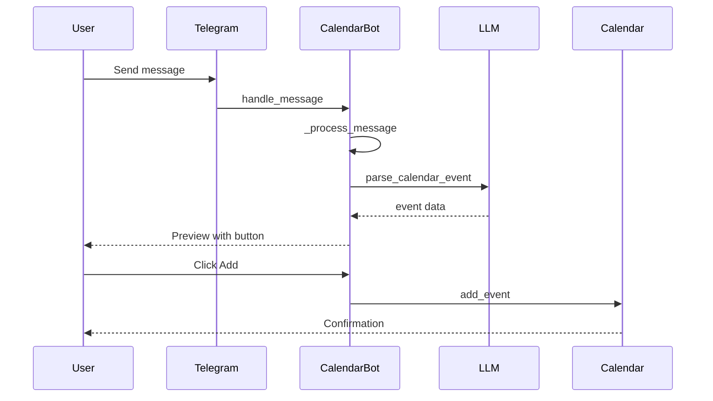
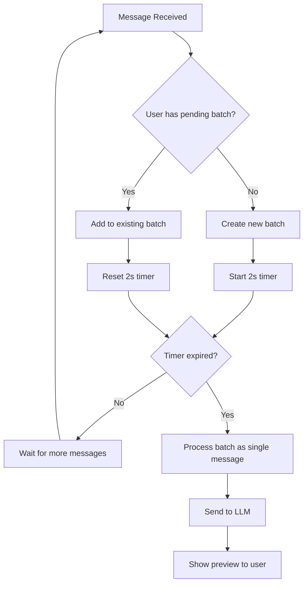
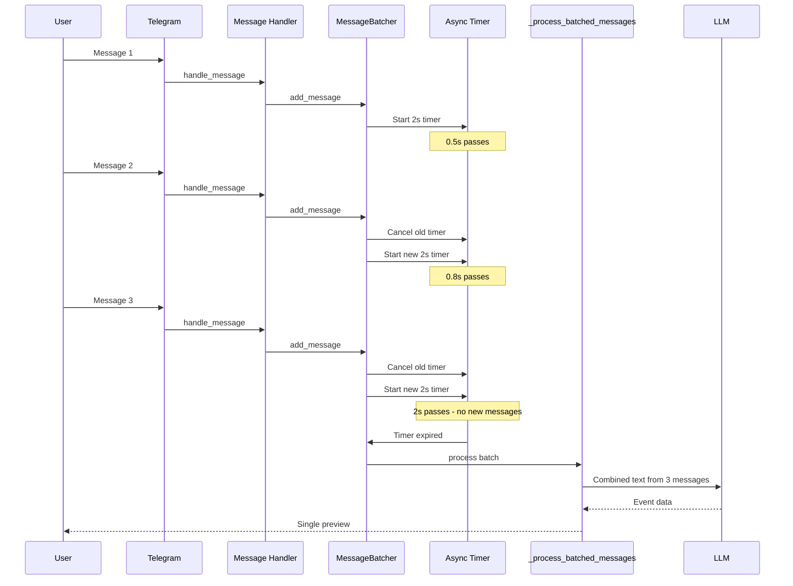

# Message Batching System Design

## 1. Current Architecture Analysis

### 1.1 Message Flow Overview

The current bot architecture in [`CalendarBot`](src/bot.py:13) processes each message independently:



### 1.2 Key Components

| Component | File | Responsibility |
|-----------|------|----------------|
| [`CalendarBot`](src/bot.py:13) | `src/bot.py` | Main bot class, message handling |
| [`_process_message()`](src/bot.py:150) | `src/bot.py` | Text message processing |
| [`_process_photo()`](src/bot.py:154) | `src/bot.py` | Photo message processing |
| [`_process_message_with_image()`](src/bot.py:79) | `src/bot.py` | Core processing logic |
| [`LLMProvider`](src/llm_base.py:7) | `src/llm_base.py` | LLM interface protocol |
| [`UserManager`](src/users.py:9) | `src/users.py` | User data and token limits |

### 1.3 Current Message Handlers

The handlers are registered in [`_setup_handlers()`](src/bot.py:204):

```python
# Photo handler (line 394-397)
@self.dp.message(lambda message: message.photo)
async def handle_photo(message: types.Message):
    asyncio.create_task(self._process_photo(message))

# Text message handler (line 399-402)
@self.dp.message()
async def handle_message(message: types.Message):
    asyncio.create_task(self._process_message(message))
```

**Key observation**: Each message spawns an independent `asyncio.create_task()`, meaning messages are processed in parallel without any coordination.

### 1.4 Problem Statement

When a user forwards a conversation or sends multiple related messages quickly:
- Each message is processed separately
- Multiple LLM calls are made
- User receives multiple event previews
- Context between messages is lost

---

## 2. Proposed Solution: Message Batching with Debounce

### 2.1 High-Level Design



### 2.2 Core Data Structures

```python
from dataclasses import dataclass, field
from typing import List, Optional
from datetime import datetime
import asyncio

@dataclass
class MessageBatch:
    """Represents a batch of messages from a single user"""
    user_id: int
    chat_id: int
    messages: List[types.Message] = field(default_factory=list)
    images: List[str] = field(default_factory=list)  # Paths to downloaded images
    created_at: datetime = field(default_factory=datetime.now)
    timer_task: Optional[asyncio.Task] = None
    
    def add_message(self, message: types.Message, image_path: Optional[str] = None):
        """Add a message to the batch"""
        self.messages.append(message)
        if image_path:
            self.images.append(image_path)
    
    def get_combined_text(self) -> str:
        """Combine all message texts into one"""
        texts = []
        for msg in self.messages:
            if msg.text:
                texts.append(msg.text)
            elif msg.caption:
                texts.append(msg.caption)
        return "\n---\n".join(texts)
    
    def get_first_message(self) -> types.Message:
        """Get the first message for reply context"""
        return self.messages[0] if self.messages else None
```

### 2.3 MessageBatcher Class

```python
class MessageBatcher:
    """Manages message batching with debounce timeout"""
    
    BATCH_TIMEOUT = 2.0  # seconds
    
    def __init__(self, process_callback):
        """
        Args:
            process_callback: Async function to call when batch is ready
                             Signature: async def callback(batch: MessageBatch)
        """
        self._batches: Dict[int, MessageBatch] = {}  # user_id -> batch
        self._process_callback = process_callback
        self._lock = asyncio.Lock()
    
    async def add_message(
        self, 
        message: types.Message, 
        image_path: Optional[str] = None
    ) -> None:
        """Add a message to the user's batch, resetting the timer"""
        user_id = message.from_user.id
        chat_id = message.chat.id
        
        async with self._lock:
            # Cancel existing timer if any
            if user_id in self._batches:
                batch = self._batches[user_id]
                if batch.timer_task and not batch.timer_task.done():
                    batch.timer_task.cancel()
            else:
                # Create new batch
                batch = MessageBatch(user_id=user_id, chat_id=chat_id)
                self._batches[user_id] = batch
            
            # Add message to batch
            batch.add_message(message, image_path)
            
            # Start new timer
            batch.timer_task = asyncio.create_task(
                self._timer_expired(user_id)
            )
    
    async def _timer_expired(self, user_id: int) -> None:
        """Called when the batch timeout expires"""
        try:
            await asyncio.sleep(self.BATCH_TIMEOUT)
            
            async with self._lock:
                if user_id not in self._batches:
                    return
                    
                batch = self._batches.pop(user_id)
            
            # Process the batch outside the lock
            await self._process_callback(batch)
            
        except asyncio.CancelledError:
            # Timer was cancelled because new message arrived
            pass
        except Exception as e:
            logger.error(f"Error processing batch for user {user_id}: {e}")
```

### 2.4 Integration with CalendarBot

Changes to [`CalendarBot`](src/bot.py:13):

```python
class CalendarBot:
    def __init__(self):
        self.settings = get_settings()
        self.bot = Bot(token=self.settings["telegram_token"])
        self.dp = Dispatcher()
        self.llm = get_llm()
        self.calendar = CalendarManager()
        self.user_manager = UserManager()
        self.parsed_events = {}
        
        # NEW: Initialize message batcher
        self.message_batcher = MessageBatcher(
            process_callback=self._process_batched_messages
        )
        
        self._setup_handlers()
    
    async def _process_batched_messages(self, batch: MessageBatch) -> None:
        """Process a batch of messages as a single unit"""
        combined_text = batch.get_combined_text()
        first_message = batch.get_first_message()
        
        # Use first image if any, or None
        image_path = batch.images[0] if batch.images else None
        
        logger.info(
            f"Processing batch for user {batch.user_id}: "
            f"{len(batch.messages)} messages, {len(batch.images)} images"
        )
        
        await self._process_message_with_image(
            first_message, 
            text=combined_text, 
            image_path=image_path
        )
        
        # Clean up any additional images
        for img_path in batch.images[1:]:
            if img_path and os.path.exists(img_path):
                try:
                    os.unlink(img_path)
                except Exception as e:
                    logger.error(f"Failed to delete temp image: {e}")
```

### 2.5 Updated Handlers

```python
def _setup_handlers(self):
    # ... existing command handlers ...
    
    @self.dp.message(lambda message: message.photo)
    async def handle_photo(message: types.Message):
        # Download image first, then add to batch
        image_path = await self._download_photo(message)
        await self.message_batcher.add_message(message, image_path)

    @self.dp.message()
    async def handle_message(message: types.Message):
        await self.message_batcher.add_message(message)
```

---

## 3. Sequence Diagram: Batched Message Flow



---

## 4. Edge Cases and Considerations

### 4.1 Multiple Images

When a user sends multiple images in quick succession:

**Option A (Recommended)**: Process only the first image
- Simpler implementation
- Most LLM providers handle single images better
- User can resend if wrong image was used

**Option B**: Combine images
- More complex, requires LLM support for multiple images
- May increase token usage significantly

### 4.2 Mixed Content (Text + Photos)

The batch combines:
- All text messages with `\n---\n` separator
- First image only (with Option A)

### 4.3 Chat vs User Isolation

Current design uses `user_id` as the batch key. This means:
- ✅ Same user in different chats: messages batched together
- ⚠️ Consider using `(user_id, chat_id)` tuple if per-chat isolation is needed

### 4.4 Memory Management

- Batches are stored in memory (`Dict[int, MessageBatch]`)
- Batches are removed after processing
- Timer cancellation prevents memory leaks
- Consider adding a maximum batch size limit

### 4.5 Error Handling

If processing fails:
- Log the error
- Clean up temporary image files
- Notify user via the first message in batch

---

## 5. Configuration Options

Add to [`src/config.py`](src/config.py):

```python
# Message batching timeout in seconds
batch_timeout = float(os.getenv("MESSAGE_BATCH_TIMEOUT", "2.0"))

# Maximum messages per batch (0 = unlimited)
max_batch_size = int(os.getenv("MAX_BATCH_SIZE", "10"))
```

---

## 6. Files to Modify

| File | Changes |
|------|---------|
| `src/bot.py` | Add `MessageBatcher` class, `MessageBatch` dataclass, update handlers |
| `src/config.py` | Add `MESSAGE_BATCH_TIMEOUT` and `MAX_BATCH_SIZE` settings |
| `README.md` | Document new batching behavior and configuration |

### 6.1 Detailed Changes to `src/bot.py`

1. **Add imports** (top of file):
   ```python
   from dataclasses import dataclass, field
   from typing import Dict, List, Optional
   ```

2. **Add `MessageBatch` dataclass** (before `CalendarBot` class)

3. **Add `MessageBatcher` class** (before `CalendarBot` class)

4. **Modify `CalendarBot.__init__()`**:
   - Add `self.message_batcher = MessageBatcher(...)`

5. **Add `_process_batched_messages()` method** to `CalendarBot`

6. **Update `handle_photo()` handler**:
   - Download image first
   - Call `self.message_batcher.add_message(message, image_path)`

7. **Update `handle_message()` handler**:
   - Call `self.message_batcher.add_message(message)`

---

## 7. Testing Strategy

### 7.1 Unit Tests

```python
import pytest
import asyncio
from unittest.mock import AsyncMock, MagicMock

@pytest.mark.asyncio
async def test_single_message_processed_after_timeout():
    """Single message should be processed after 2 second timeout"""
    callback = AsyncMock()
    batcher = MessageBatcher(process_callback=callback)
    
    message = MagicMock()
    message.from_user.id = 123
    message.chat.id = 456
    message.text = "Test message"
    
    await batcher.add_message(message)
    
    # Should not be called immediately
    callback.assert_not_called()
    
    # Wait for timeout
    await asyncio.sleep(2.5)
    
    # Should be called once
    callback.assert_called_once()
    batch = callback.call_args[0][0]
    assert len(batch.messages) == 1

@pytest.mark.asyncio
async def test_multiple_messages_batched():
    """Multiple messages within timeout should be batched"""
    callback = AsyncMock()
    batcher = MessageBatcher(process_callback=callback)
    
    for i in range(3):
        message = MagicMock()
        message.from_user.id = 123
        message.chat.id = 456
        message.text = f"Message {i}"
        await batcher.add_message(message)
        await asyncio.sleep(0.5)  # Less than timeout
    
    await asyncio.sleep(2.5)
    
    callback.assert_called_once()
    batch = callback.call_args[0][0]
    assert len(batch.messages) == 3

@pytest.mark.asyncio
async def test_different_users_separate_batches():
    """Messages from different users should be in separate batches"""
    callback = AsyncMock()
    batcher = MessageBatcher(process_callback=callback)
    
    for user_id in [123, 456]:
        message = MagicMock()
        message.from_user.id = user_id
        message.chat.id = 789
        message.text = f"Message from {user_id}"
        await batcher.add_message(message)
    
    await asyncio.sleep(2.5)
    
    assert callback.call_count == 2
```

### 7.2 Integration Tests

- Test with real Telegram bot in test mode
- Verify typing indicator behavior during batch collection
- Test with forwarded messages
- Test with mixed text and photo messages

---

## 8. Future Enhancements

1. **Typing indicator during batch collection**: Show "typing" while waiting for more messages
2. **Batch preview**: Show user how many messages are queued
3. **Cancel batch**: Allow user to cancel pending batch with a command
4. **Per-chat batching**: Use `(user_id, chat_id)` for isolation
5. **Smart timeout**: Adjust timeout based on message frequency patterns
